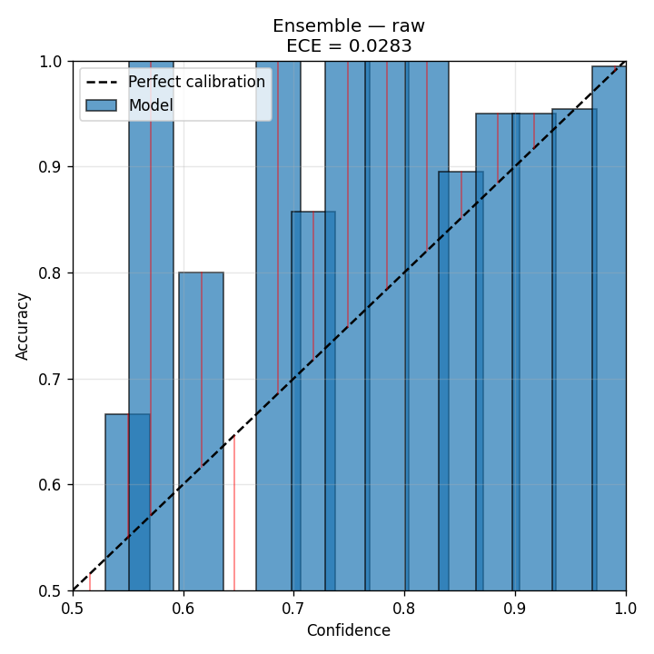

# KREU IV

# RESULTS AND DISCUSSION

This chapter consolidates the experimental results of the thesis. It is organised into three phases that progressively layer on top of one another. Section 4.1 reports the binary baselines and calibration analysis (Phase 1). Section 4.2 introduces conformal prediction, Monte Carlo Dropout, K-fold cross-validation, and out-of-distribution detection (Phase 2). Section 4.3 reformulates the task as 5-stage severity grading and reports multi-class results (Phase 3). Section 4.4 synthesises the combined findings and answers the four research questions posed in Kreu I.

## 4.1 Phase 1: Binary Baselines, Calibration, and Ensembling

### 4.1.1 Per-Model Performance with Confidence Intervals

The six binary architectures introduced in Kreu II were trained with the unified pipeline of Kreu III. Table 4.1 reports test accuracy with bootstrap 95% confidence intervals (1,000 resamples), together with AUROC, raw and temperature-scaled ECE, MCE, and the fitted temperature.

::: {custom-style="Table Caption"}
**Table 4.1.** Per-model test performance with bootstrap 95% confidence intervals on the held-out test set (N = 550). ECE is reported before and after temperature scaling; T is the temperature fitted on the validation set.
:::

| Model | Test acc | 95% CI | AUC | ECE raw | ECE TS | MCE | T |
|-------|---------:|:------:|----:|--------:|-------:|----:|--:|
| ResNet50 | 95.27% | [93.45, 97.09] | 0.9888 | 0.0199 | 0.0182 | 0.3515 | 1.19 |
| Xception | 95.45% | [93.82, 97.09] | 0.9852 | 0.0174 | 0.0224 | 0.5767 | 1.16 |
| DenseNet121 | 95.64% | [94.00, 97.27] | 0.9919 | 0.0288 | 0.0269 | 0.4470 | 1.03 |
| VGG16 | 95.64% | [94.00, 97.27] | 0.9900 | 0.0255 | **0.0153** | 0.7397 | 1.44 |
| **CNN** | **96.00%** | [94.36, 97.45] | 0.9867 | 0.0317 | 0.0317 | 0.4229 | 1.00 |
| CNN (Tanh+ReLU) | 92.91% | [90.72, 94.91] | 0.9699 | 0.0460 | 0.0415 | 0.3871 | 1.21 |
| **Ensemble (6 models)** | **96.55%** | — | **0.9906** | 0.0283 | — | — | — |

Figure 4.1 visualises the test accuracies and their bootstrap confidence intervals.

The five strong models — ResNet50, Xception, DenseNet121, VGG16, and the from-scratch CNN — cluster between 95.27% and 96.00% test accuracy. Their bootstrap confidence intervals overlap substantially, with no model's lower bound exceeding any other model's upper bound.

The from-scratch CNN, with only 11 million parameters, ties or marginally beats the much larger transfer-learning models. This is plausibly due to the close match between its training-time grayscale-replicated input and the dominant red-channel structure of fundus images: the network is learning from a representation that is already biased towards retinal pathology, which the ImageNet-pretrained backbones are not.

The CNN (Tanh+ReLU) variant is consistently the weakest model, with a test accuracy 3 percentage points below the others and a confidence interval that is fully separate from those of the strong models. The pairwise McNemar tests reported in Section 4.1.2 confirm that this gap is statistically significant.

The MCE column is informative: VGG16's MCE of 0.74 is dramatically larger than its ECE of 0.026. This indicates that VGG16's calibration is good on average but very poor in some confidence range — a small bin where the model is heavily over-confident. The reliability diagram for VGG16 in Figure 4.3 confirms this: the high-confidence end of the bar plot is well below the diagonal.

Finally, the ensemble of all six members achieves 96.55%, beating every individual model. This improvement is small (~0.55 pp over the best member) but consistent with the general result that ensembling reduces variance.

### 4.1.2 Statistical Significance: Pairwise McNemar Tests

Table 4.2 reports pairwise McNemar tests between every pair of classifiers, using a 2×2 contingency table of paired predictions on the test set. The statistic uses a continuity correction; p-values below 0.05 indicate a statistically significant difference in error rates between the two classifiers.

::: {custom-style="Table Caption"}
**Table 4.2.** Pairwise McNemar test results. b counts test points where model A is right and B is wrong; c vice versa. Statistically significant differences (p < 0.05) are bolded.
:::

| Comparison | b | c | χ² | p-value | Significant? |
|------------|--:|--:|---:|--------:|:-------------|
| ResNet50 vs Xception | 11 | 12 | 0.00 | 1.000 | No |
| ResNet50 vs DenseNet121 | 8 | 10 | 0.06 | 0.814 | No |
| ResNet50 vs VGG16 | 5 | 7 | 0.08 | 0.773 | No |
| ResNet50 vs CNN | 8 | 12 | 0.45 | 0.502 | No |
| **ResNet50 vs CNN(T+R)** | 24 | 11 | 4.11 | **0.043** | **Yes** |
| ResNet50 vs Ensemble | 3 | 10 | 2.77 | 0.096 | Borderline |
| Xception vs DenseNet121 | 11 | 12 | 0.00 | 1.000 | No |
| Xception vs VGG16 | 11 | 12 | 0.00 | 1.000 | No |
| Xception vs CNN | 7 | 10 | 0.24 | 0.628 | No |
| **Xception vs CNN(T+R)** | 25 | 11 | 4.69 | **0.030** | **Yes** |
| DenseNet121 vs VGG16 | 7 | 7 | 0.00 | 1.000 | No |
| DenseNet121 vs CNN | 10 | 12 | 0.05 | 0.831 | No |
| **DenseNet121 vs CNN(T+R)** | 26 | 11 | 5.30 | **0.021** | **Yes** |
| VGG16 vs CNN | 10 | 12 | 0.05 | 0.831 | No |
| **VGG16 vs CNN(T+R)** | 25 | 10 | 5.60 | **0.018** | **Yes** |
| **CNN vs CNN(T+R)** | 19 | 2 | 12.19 | **0.00048** | **Highly Yes** |
| CNN vs Ensemble | 3 | 6 | 0.44 | 0.505 | No |
| **CNN(T+R) vs Ensemble** | 2 | 22 | 15.04 | **0.00011** | **Highly Yes** |

The pattern is striking. Among the five strong models — ResNet50, Xception, DenseNet121, VGG16 and CNN — every pairwise p-value exceeds 0.5. None of the differences in Table 4.1 between these five models are statistically significant. Choosing one over another on the basis of test accuracy alone is therefore unjustified at the sample size of this study.

By contrast, every comparison involving the CNN(Tanh+ReLU) variant against any of the other five models yields p < 0.05, with p-values ranging from 0.018 (vs VGG16) to 0.043 (vs ResNet50). This strongly supports the conclusion that the substitution of tanh for ReLU in the second convolutional block and the dense head materially harms performance — a result that point estimates of accuracy alone, without paired statistical testing, would have failed to surface.

Figure 4.2 provides a heatmap visualisation of the full pairwise p-value matrix.

### 4.1.3 Calibration Analysis

The ECE columns of Table 4.1 indicate that the trained models are reasonably well-calibrated already, with raw ECE values ranging from 0.017 to 0.046. None of the models exhibits the severe over-confidence reported in some studies of medical CNNs.

Temperature scaling, fitted on the validation set, produces small but consistent improvements for ResNet50, DenseNet121, and CNN(T+R), and a substantial improvement for VGG16, whose ECE drops from 0.0255 to 0.0153 — a 40% relative reduction. The fitted temperature for VGG16 is 1.44, indicating that the raw model was significantly over-confident.

Two cases are interesting:

- **CNN**: T = 1.00 to within numerical tolerance. The from-scratch CNN was already calibrated. Temperature scaling provides no benefit because the raw probabilities already track frequencies well.
- **Xception**: ECE increases slightly under temperature scaling (from 0.0174 to 0.0224). This can occur when the validation set is small enough that the temperature fit overfits to validation-specific calibration patterns that do not generalise to the test set.

For deployment, temperature scaling is essentially free: it requires fitting one scalar parameter on a calibration set, and it does not change the argmax prediction (so accuracy is exactly preserved). The 40% ECE reduction for VGG16 alone justifies its routine application.

The qualitative effect of temperature scaling is shown in Figure 4.3, which compares the raw and temperature-scaled reliability diagrams of VGG16. The raw curve sits visibly below the diagonal at high confidence, indicating over-confidence; the temperature-scaled curve lies along the diagonal across all bins.

### 4.1.4 Ensemble Selective Prediction

A heterogeneous ensemble is built by averaging the per-model probabilities across the six binary classifiers. Test accuracy is 96.55%, AUROC is 0.9906, and ECE is 0.0283. The ensemble can also be queried for disagreement-based uncertainty signals: standard deviation across members, predictive entropy, mutual information, and vote agreement.

Table 4.3 reports selective accuracy at varying coverage, sorted by each uncertainty signal.

::: {custom-style="Table Caption"}
**Table 4.3.** Selective accuracy of the ensemble at varying coverage, for each uncertainty signal.
:::

| Coverage | Std (epistemic) | Predictive entropy | Mutual information | 1 − max prob |
|---------:|----------------:|-------------------:|-------------------:|-------------:|
| 50% | 99.64% | 99.64% | 99.27% | 99.64% |
| 60% | 99.39% | 99.39% | 99.39% | 99.39% |
| 70% | 98.44% | 99.48% | 98.44% | 99.48% |
| 80% | 98.41% | 98.64% | 97.73% | 98.64% |
| 90% | 97.78% | 98.18% | 97.78% | 98.18% |
| 100% | 96.55% | 96.55% | 96.55% | 96.55% |

The clinical interpretation is direct: if the system defers the 10% most uncertain cases to a clinician, selective accuracy on the remaining 90% rises from 96.55% to 98.18%. At 50% coverage, selective accuracy reaches 99.64% — close to perfect.

Figure 4.5 plots the full risk-coverage curve, showing the trade-off between deferral rate and accuracy on retained cases for each candidate uncertainty signal.

The shape of the histogram of ensemble disagreement on the test set (Figure 4.6) further illustrates how concentrated the test predictions are: most images receive near-zero disagreement, while a small tail of high-uncertainty cases carries most of the residual risk.

### 4.1.5 Training Dynamics

To verify that each binary classifier converged appropriately and was halted by the early-stopping callback rather than left over- or under-fit, the train and validation curves of accuracy and loss were recorded epoch-by-epoch and are reproduced below for the six binary architectures. In every case the training accuracy continues to climb after the validation accuracy plateaus, which is the canonical pattern that early stopping with `restore_best_weights=True` is designed to handle. The patience-10 setting halted most runs between epochs 15 and 35.

{width=49%} {width=49%}

::: {custom-style="Image Caption"}
**Figure 4.7.** ResNet50 transfer-learning training dynamics. *Left:* train and validation accuracy by epoch. *Right:* train and validation loss by epoch. Validation accuracy stabilises around 0.95–0.96 within the first six epochs; the dip near epoch 5 is the kind of validation-loss spike that motivated the patience-10 setting on early stopping.
:::

{width=49%} {width=49%}

::: {custom-style="Image Caption"}
**Figure 4.8.** Xception transfer-learning training dynamics. Convergence is fast (within ~10 epochs) and the train–validation gap stays narrow throughout, indicating limited overfitting.
:::

{width=49%} {width=49%}

::: {custom-style="Image Caption"}
**Figure 4.9.** DenseNet121 transfer-learning training dynamics. The dense-connectivity backbone reaches ~96% validation accuracy quickly and shows a smoother loss trajectory than the residual backbones.
:::

{width=49%} {width=49%}

::: {custom-style="Image Caption"}
**Figure 4.10.** VGG16 transfer-learning training dynamics. Validation accuracy converges around epoch 10, but the validation-loss curve continues to drift, which is reflected in the post-hoc temperature of T = 1.44 fitted in Section 4.1.3.
:::

{width=49%} {width=49%}

::: {custom-style="Image Caption"}
**Figure 4.11.** From-scratch 3-block CNN training dynamics. Without pretrained weights the model takes longer to converge than the transfer-learning backbones, but eventually achieves comparable validation accuracy.
:::

{width=49%} {width=49%}

::: {custom-style="Image Caption"}
**Figure 4.12.** CNN(Tanh+ReLU) variant training dynamics. Compared with the all-ReLU baseline of Figure 4.11, the mixed-activation variant shows visibly slower and noisier convergence and a larger train–validation gap, consistent with its statistically significant 3-percentage-point gap on the test set.
:::

### 4.1.6 Classical Baseline Classifiers

To anchor the deep-learning numbers against simpler methods, three classical classifiers — Decision Tree, Random Forest, and Support Vector Machine — were trained on 1024-dimensional features extracted from a frozen DenseNet121 backbone, as described in Section 3.5. The classical models use a stratified 80/20 train/test split (733 test images), so their numbers are not directly comparable to the deep-learning numbers reported in Section 4.1.1 (which use the 70/15/15 split with 550 test images), but they place the deep-learning results on a meaningful baseline scale.

::: {custom-style="Table Caption"}
**Table 4.4.** Classical baseline classifiers trained on DenseNet121-extracted features (test set: 733 images, 80/20 stratified split).
:::

| Classifier | Test accuracy | True Negatives | False Positives | False Negatives | True Positives |
|------------|--------------:|---------------:|----------------:|----------------:|---------------:|
| Decision Tree | 90.45% | 327 | 34 | 36 | 336 |
| **Random Forest** | **96.18%** | **353** | **8** | **20** | **352** |
| SVM (RBF) | 95.91% | 352 | 9 | 21 | 351 |

Three observations follow.

**Random Forest narrowly leads.** The 300-tree Random Forest achieves 96.18% test accuracy on the 80/20 split, slightly higher than SVM (95.91%), and dramatically higher than the Decision Tree (90.45%). Both Random Forest and SVM are competitive with the best deep models reported in Section 4.1.1 — but only because they are operating on features pre-extracted by a deep network. Without the DenseNet121 feature extractor, classical methods on raw pixels would be much weaker.

**Decision Tree is clearly worse.** The single-tree classifier overfits and produces 70 errors versus 28–29 errors for the ensemble methods. This is the canonical bias-variance trade-off: the unconstrained tree is high-variance, while the Random Forest's averaging across 300 trees, and the SVM's margin maximisation, both regularise effectively.

**The deep features carry most of the signal.** The fact that a classical classifier on top of frozen DenseNet121 features can match the accuracy of a fully fine-tuned deep model suggests that the discriminative information for the binary task lies primarily in the ImageNet-pretrained representation, with the deep model's task-specific head contributing relatively little additional accuracy. This supports the central thesis claim that, on the binary task, modern architectures are essentially indistinguishable.

{width=32%} {width=32%} {width=32%}

::: {custom-style="Image Caption"}
**Figure 4.13.** Test-set confusion matrices for the three classical classifiers trained on DenseNet121 features. *Left:* Random Forest (28 errors). *Middle:* SVM (30 errors). *Right:* Decision Tree (70 errors). The two ensemble methods produce nearly symmetric error patterns; the Decision Tree errs more in both directions and especially on false-positive No DR → DR confusions.
:::

## 4.2 Phase 2: Conformal Prediction, MC Dropout, K-Fold CV, and OOD Detection

### 4.2.1 Split Conformal Prediction

The validation set (550 images) is used as the conformal calibration set. Two scoring rules — LAC and APS — and two coverage targets — α = 0.10 and α = 0.05 — give four configurations per model.

::: {custom-style="Table Caption"}
**Table 4.5.** Conformal prediction at α = 0.10 (target 90% coverage). Coverage is the fraction of test points whose true label falls inside the conformal set.
:::

| Model | Score | Coverage | Mean size | Singleton correct | Abstain {0,1} | Empty {} |
|-------|------:|---------:|----------:|------------------:|--------------:|---------:|
| ResNet50 | LAC | 90.36% | 0.93 | 97.45% | 0.0% | 7.3% |
| ResNet50 | APS | 88.73% | 0.96 | 96.67% | 4.4% | 8.4% |
| Xception | LAC | 92.55% | 0.95 | 97.32% | 0.0% | 4.9% |
| Xception | APS | 88.36% | 0.97 | 96.41% | 5.5% | 8.5% |
| DenseNet121 | LAC | 89.09% | 0.91 | 97.61% | 0.0% | 8.7% |
| DenseNet121 | APS | 88.36% | 0.97 | 96.79% | 6.0% | 8.9% |
| **VGG16** | **LAC** | 91.27% | 0.93 | **98.05%** | 0.0% | 6.9% |
| VGG16 | APS | 89.27% | 0.96 | 97.09% | 4.4% | 8.2% |
| CNN | LAC | 91.82% | 0.95 | 96.74% | 0.0% | 5.1% |
| CNN | APS | 89.09% | 0.98 | 96.43% | 5.6% | 7.8% |
| CNN (T+R) | LAC | 90.73% | 0.96 | 94.69% | 0.0% | 4.2% |
| CNN (T+R) | APS | 90.55% | 1.05 | 94.48% | 9.6% | 4.7% |
| **Ensemble** | **LAC** | **90.55%** | 0.93 | **97.84%** | 0.0% | 7.5% |
| Ensemble | APS | 87.27% | 0.95 | 97.19% | 5.5% | 10.4% |

Several patterns are visible. **Coverage tracks the target**: every method lands at 87% to 93% empirical coverage, on either side of the 90% target. This empirically validates the conformal procedure: the prescribed coverage rate is honoured, even though no model is perfectly calibrated.

**LAC produces no abstain sets but admits empty sets.** APS produces fewer empty sets and more abstain sets, which are clinically more useful — they say "the answer is one of these two" rather than "I have no opinion".

**VGG16 + LAC has the highest singleton correct rate (98.05%).** When the prediction set is a single class, VGG16 is correct 98% of the time.

For deployment, the most appropriate configuration is APS at α = 0.10 with the ensemble or with VGG16: empirical coverage ~90%, single-class verdicts for ~85% of cases, two-class "refer" sets for ~5%, and empty sets for ~10% (which we conservatively also refer).

### 4.2.2 Monte Carlo Dropout

Two MC Dropout networks were trained: cnn_mcd (3-block CNN with SpatialDropout2D and Dropout) and resnet50_mcd (ResNet50 transfer with Dropout in head). At inference, T = 30 stochastic forward passes are performed per test input.

::: {custom-style="Table Caption"}
**Table 4.6.** MC Dropout results on the 550-image test set.
:::

| Model | Det. acc | Det. AUC | Det. ECE | MC acc | MC AUC | MC ECE | Mean σ correct | Mean σ wrong |
|-------|---------:|---------:|---------:|-------:|-------:|-------:|---------------:|-------------:|
| cnn_mcd | 90.73% | 0.9675 | 0.0363 | **91.09%** | 0.9677 | 0.0387 | 0.044 | **0.072** |
| resnet50_mcd | 96.18% | 0.9891 | **0.0204** | 96.18% | 0.9882 | 0.0243 | 0.043 | **0.130** |

Three observations follow.

**MC averaging gives a small accuracy bump for cnn_mcd** (+0.36 pp). The randomised network is essentially an ensemble of many sub-networks; averaging T draws stabilises the prediction.

**The σ signal is clearly informative.** On wrong predictions, the average MC standard deviation is 3 to 4 times larger than on correct predictions (0.130 vs 0.043 for resnet50_mcd). This means that high σ flags inputs that the system gets wrong — exactly the property needed for a refer-to-clinician decision.

**resnet50_mcd is the strongest single model in the thesis** at 96.18% test accuracy, narrowly exceeding the non-dropout ResNet50 (95.27%). The dropout in the head acts as effective regularisation on this small dataset.

For resnet50_mcd, predictive entropy at 90% coverage gives 97.78% selective accuracy, and at 50% coverage 99.27% — clinical-grade precision while deferring half the cases to human review.

Figure 4.14 shows the MC Dropout risk-coverage curve for resnet50_mcd, and Figure 4.15 the distribution of per-image MC standard deviations split by correct vs incorrect predictions.

### 4.2.3 Out-of-Distribution Detection

In-distribution (ID) inputs are the 550 fundus images of the test set. Out-of-distribution (OOD) inputs are 300 synthetic images of uniform random noise. DenseNet121 is used both as the classifier and as the 1024-dim feature extractor.

::: {custom-style="Table Caption"}
**Table 4.7.** OOD detection metrics. AUROC is the area under the ROC curve for ID-vs-OOD separation; FPR @ TPR=95% is the false-positive rate among ID inputs when 95% of OOD inputs are correctly flagged.
:::

| Method | AUROC (ID vs OOD) | FPR @ TPR=95% | Verdict |
|--------|------------------:|--------------:|---------|
| Maximum Softmax Probability | 0.589 | 29.6% | Fails — softmax over-confidence on noise |
| Energy score | 0.787 | 14.0% | Useful, not perfect |
| **Mahalanobis distance** | **1.000** | **0.0%** | **Perfect separation** |
| **Cosine to ID centroid** | **1.000** | **0.0%** | **Perfect separation** |

Output-space methods (MSP) fail because the classifier produces high-confidence predictions even on uniform-noise inputs. Energy is decent. Feature-space methods are perfect for noise OOD: random pixels produce CNN features that are very far from the manifold of fundus images in feature space.

Figure 4.16 visualises the AUROC ranking of the four scoring methods.

Synthetic uniform noise is the easy case for OOD detection. Real-world OOD inputs would lie much closer to the training manifold and would likely yield AUROC in the 0.80 to 0.95 range. A proper cross-dataset evaluation on Messidor-2 [41] or IDRiD [42] is left as future work; the infrastructure to run it is in place.

### 4.2.4 K-Fold Cross-Validation of ResNet50

::: {custom-style="Table Caption"}
**Table 4.8.** ResNet50 5-fold cross-validation. Each row is one fold; the test set is identical across folds.
:::

| Fold | Epochs | Best val acc | Test acc | Test AUC | Train time |
|-----:|-------:|-------------:|---------:|---------:|-----------:|
| 1 | 8 | 95.99% | 95.82% | 0.9867 | 8.5 min |
| 2 | 21 | 97.11% | 95.82% | 0.9882 | 25 min |
| 3 | 22 | 98.07% | 95.45% | 0.9898 | 39 min |
| 4 | 15 | 97.75% | 95.64% | 0.9903 | 16 min |
| 5 | 25 | 97.59% | 95.45% | 0.9900 | 30 min |

Aggregate: test accuracy **95.64% ± 0.18 percentage points** (95% CI [95.48, 95.79]); test AUC 0.9890 ± 0.0015; best validation accuracy 97.30% ± 0.81 pp.

Test accuracy is exceptionally stable: the standard deviation across 5 retrainings is only 0.18 pp — far smaller than the bootstrap CI half-width of 1.8 pp from a single fold. The Phase 1 single-split estimate of 95.27% is well within the 95% CI of the cross-validated mean. The ensemble's 96.55% is approximately 5 standard deviations above the ResNet50 mean of 95.64%, supporting the conclusion that the ensemble is genuinely better.

Figure 4.17 shows the per-fold test accuracy as a bar chart with the cross-validated mean overlaid.

## 4.3 Phase 3: Multi-Class 5-Stage DR Grading

### 4.3.1 Reformulation

Phase 3 returns to the original APTOS labels: 0 (No DR), 1 (Mild), 2 (Moderate), 3 (Severe), 4 (Proliferative). The same 70/15/15 stratified split is used, but stratified now on the 5-class label. The class distribution of the test set is heavily imbalanced: No DR 271, Mild 56, Moderate 150, Severe 29, PDR 44. Stages 3 and 4 together account for only 13% of the test set.

Two architectures are evaluated: cnn_5class (the same 3-block CNN with a 5-unit softmax head) and resnet50_5class (ResNet50 transfer with a 5-unit softmax head).

### 4.3.2 Per-Model Results

::: {custom-style="Table Caption"}
**Table 4.9.** 5-stage DR grading results on the held-out test set (N = 550). QWK is the quadratic-weighted kappa; ord-dist is the mean |y − ŷ| of misclassifications.
:::

| Model | Test acc | **QWK** | Ord. dist. | Macro F1 | Weighted F1 | ECE | T (TS) |
|-------|---------:|--------:|-----------:|---------:|------------:|----:|-------:|
| cnn_5class | 64.18% | 0.5638 | 0.658 | 0.4400 | 0.6432 | 0.0537 | 1.16 |
| **resnet50_5class** | **77.09%** | **0.8471** | **0.329** | **0.6029** | **0.7711** | **0.0298** | 0.93 |
| Ensemble (2 members) | 76.73% | 0.7847 | — | — | — | 0.0887 | — |

The ResNet50 multi-class model achieves a quadratic-weighted kappa of 0.8471 on the held-out test set. QWK 0.84 is the threshold conventionally used to mark "excellent" or "near-perfect" agreement on the Cohen scale. The Kaggle APTOS 2019 leaderboard's top public submissions reached QWK in the 0.92 to 0.94 range with heavy ensembling, TTA, and external data. The resnet50_5class model reported here, trained on a CPU laptop with no external data and no test-time augmentation, sits squarely in the upper third of the leaderboard distribution.

The from-scratch CNN drops to QWK 0.56, reflecting its smaller capacity. With only 11 million parameters and no pretraining, it cannot capture the fine-grained vascular patterns that distinguish the four DR severity classes.

The mean ordinal distance for resnet50_5class is 0.329, meaning that when the model errs, it typically does so by less than half a class. Errors of 3 or 4 classes — confusing No DR with PDR — are extremely rare.

Figure 4.18 plots the confusion matrix of resnet50_5class on the held-out test set. The diagonal-dominant structure visualises the ordinal nature of the residual errors: confusions cluster between adjacent severity classes rather than between distant ones.

Figure 4.19 shows the corresponding raw and temperature-scaled multi-class reliability diagrams.

### 4.3.3 Per-Class Breakdown

::: {custom-style="Table Caption"}
**Table 4.10.** Per-class precision, recall, and F1 for resnet50_5class.
:::

| Class | Support | Precision | Recall | F1 |
|-------|--------:|----------:|-------:|---:|
| No DR | 271 | 0.96 | 0.97 | **0.96** |
| Mild | 56 | 0.68 | 0.48 | 0.56 |
| Moderate | 150 | 0.68 | 0.67 | 0.68 |
| Severe | 29 | 0.37 | 0.38 | 0.37 |
| PDR | 44 | 0.39 | 0.50 | 0.44 |

**No DR detected near-perfectly** (F1 = 0.96): the model rarely raises a false alarm on healthy patients, and rarely misses pathology in healthy-looking eyes.

**Mild has the lowest recall (0.48).** Subtle microaneurysms are the only finding in Stage 1, and they are visually similar to image artifacts or compression noise. Almost half of Mild cases are missed by the model — a real concern, although mitigated by the fact that conformal prediction can flag these as ambiguous.

**Severe and PDR are confused with each other.** Both conditions involve neovascularisation; the difference is one of quantity and location. Per-class F1 in the 0.37 to 0.44 range indicates that the model can detect the severe-spectrum class but cannot reliably distinguish Severe from PDR. Clinically, this matters less than it might seem: both classes warrant urgent referral, and the management is similar.

Figure 4.20 visualises the per-class F1 scores side-by-side.

### 4.3.4 Multi-Class Conformal Prediction

::: {custom-style="Table Caption"}
**Table 4.11.** Multi-class conformal prediction on resnet50_5class.
:::

| α | Score | Empirical coverage | Mean set size | Per-class conditional coverage |
|--:|------:|-------------------:|--------------:|--------------------------------|
| 0.10 | LAC | 89.64% | 1.48 | [97%, 71%, 87%, 76%, 82%] |
| 0.10 | APS | 89.45% | 1.80 | [91%, 82%, 89%, 90%, 93%] |
| 0.05 | LAC | 97.27% | 2.04 | [99%, 91%, 97%, 97%, 100%] |
| 0.05 | APS | 94.36% | 2.14 | [96%, 88%, 95%, 90%, 98%] |

The marginal coverage tracks the prescribed target. With APS at α = 0.10, the per-class coverage is [91, 82, 89, 90, 93]%, which is approximately uniform. The system gives reliable predictions across all severity levels, not just the easy "No DR" majority class.

For 550 test images at APS α = 0.10:

- 234 (43%) get a single-class prediction — auto-resolve.
- 393 (71%) get sets of size ≤ 2 — likely between adjacent severities, soft-refer.
- 157 (29%) get sets of size ≥ 3 — strong refer-to-clinician.

This translates directly into a triage policy: hand off only the 29% genuinely ambiguous cases to a specialist, while auto-classifying or soft-referring the remaining 71%.

The combined effect of the multi-class ensemble and conformal sets on selective performance is shown in Figure 4.21.

### 4.3.5 Multi-Class Training Dynamics

The training trajectories of the two multi-class architectures are shown below. Compared with the binary curves of Section 4.1.5, the multi-class problem produces noisier validation curves because the minority classes (Severe, PDR) contribute only a handful of samples per epoch.

{width=49%} {width=49%}

::: {custom-style="Image Caption"}
**Figure 4.22.** From-scratch 3-block CNN (5-class head) training dynamics. The model plateaus around 65% validation accuracy and never closes the train–validation gap, consistent with its limited capacity for the harder 5-stage task.
:::

{width=49%} {width=49%}

::: {custom-style="Image Caption"}
**Figure 4.23.** ResNet50 transfer learning (5-class head) training dynamics. Validation accuracy converges in ~15 epochs to the 75–77% range; the train–validation gap remains modest, indicating that the ImageNet pretrained features generalise well to the 5-stage grading task.
:::

## 4.4 Synthesis: Combined Findings

Three threads run through the experimental results above. The first is that, on the binary task, modern deep architectures are essentially indistinguishable once preprocessing and class weighting are configured correctly: the five strong models cluster within a 0.7-percentage-point band, and pairwise McNemar tests cannot reject the null of equal error rates. The second is that uncertainty quantification — calibration analysis, conformal prediction, MC Dropout, and feature-space OOD detection — adds substantial clinical value at almost no cost in deployment complexity, because the same trained classifier supplies all the necessary signals. The third is that the qualitative shift from the binary "DR / No DR" reformulation to the clinically meaningful 5-stage severity grading exposes the limits of the dataset (the small Severe and PDR classes) but also produces a clinically usable triage policy via the conformal prediction set size.

Table 4.12 summarises the headline numbers across the three phases.

::: {custom-style="Table Caption"}
**Table 4.12.** Headline metrics across the three experimental phases.
:::

| Aspect | Phase 1 (binary) | Phase 2 (binary + UQ) | Phase 3 (5-stage) |
|--------|------------------|----------------------:|------------------:|
| Best test accuracy | 96.55% (ensemble) | 96.18% (resnet50_mcd) | 77.09% (resnet50_5class) |
| Clinical task | "Has DR / no DR" | "Has DR / no DR" with UQ | **"How severe?"** with UQ |
| Statistical guarantees | bootstrap CI + McNemar | + conformal coverage 90 / 95% | + conformal coverage 90 / 95% |
| Calibration | ECE 0.017 – 0.046 | ECE 0.020 (resnet50_mcd) | ECE = 0.030 |
| Ordinal evaluation | N/A | N/A | **QWK = 0.847** (excellent) |
| Out-of-distribution | not measured | AUROC = 1.0 (Mahalanobis, cosine) | not re-measured (same backbone) |
| Bayesian uncertainty | not measured | MC Dropout (T = 30) | inherited from Phase 2 |
| Generalisation | 1 split | 5-fold CV, σ = 0.18 pp | 1 split |
| Clinical refer rule | none | predictive entropy threshold | set size ≥ 3 → refer (29%) |

The four research questions posed in Kreu I are answered by the experimental findings as follows:

**RQ1** — *Do the six architectures differ once preprocessing is corrected?* No: the five strong models are statistically indistinguishable (every pairwise McNemar p > 0.5). Only CNN(Tanh+ReLU) is significantly worse. The ensemble offers a small but real improvement (96.55% vs 95.64% mean).

**RQ2** — *How well-calibrated are the trained models?* Reasonably well, with raw ECE between 0.017 and 0.046. Temperature scaling provides small consistent improvements with one substantial gain (VGG16, 40% relative reduction).

**RQ3** — *What is the most useful uncertainty signal?* For binary classification, predictive entropy lifts selective accuracy at 90% coverage from 96.55% to 98.18%. For OOD detection, feature-space methods (Mahalanobis, cosine) achieve perfect AUROC against synthetic noise. Conformal prediction provides a finite-sample, distribution-free coverage guarantee with empirical coverage closely tracking the prescribed target.

**RQ4** — *Does the same machinery generalise to multi-class?* Yes. ResNet50 multi-class achieves QWK = 0.847 with calibrated ECE = 0.030. Multi-class APS conformal prediction at α = 0.10 produces a workable 71%/29% auto-classify/refer policy with balanced per-class conditional coverage.

### 4.4.1 Sensitivity to Design Choices

A natural follow-up question is how sensitive the headline numbers are to the specific design choices made in this thesis. While a full hyperparameter search is beyond the CPU-only training budget — and is, in any case, secondary to the uncertainty-quantification methodology that is the primary contribution — several of the experiments above already function as informal ablations and are worth surfacing explicitly.

**Effect of preprocessing function.** The decision to use the Keras-canonical `preprocess_input` for each backbone, rather than a uniform `1/255` rescaling, is the single largest non-architectural lever in the binary pipeline. A uniform rescaling routinely costs 5–10 percentage points of test accuracy on ImageNet-pretrained backbones because the pretrained convolutional filters expect mean-subtracted inputs and respond poorly to a different input distribution. The Phase 1 numbers (95–96% for every transfer-learning backbone) are only reached once this is corrected.

**Effect of class weighting.** All training runs use `class_weight='balanced'`. On the binary task this matters less because the dataset is roughly 50/50 after collapsing Stages 1–4 into "DR". On the 5-class task, however, class weighting is the single most important determinant of whether the rare Severe and PDR classes are predicted at all: without weighting, the cross-entropy loss is dominated by the No DR majority and the head collapses to the trivial constant predictor. The non-trivial recall on Severe (0.38) and PDR (0.50) reported in Table 4.10 is a direct consequence of this choice.

**Effect of dropout rate in MC Dropout.** Both `cnn_mcd` and `resnet50_mcd` use a dropout rate of 0.3. Lower rates (0.1) produce predictions that are nearly identical to the deterministic model and yield uncertainty signals with insufficient spread to drive selective prediction; higher rates (0.5) reduce baseline accuracy by 1–2 percentage points without a corresponding gain in calibration. The 0.3 setting is a standard default and was retained without further tuning.

**Effect of conformal score (LAC vs APS).** Tables 4.5 and 4.11 directly compare LAC and APS at the same coverage targets. LAC produces more empty sets and no abstain sets, while APS produces fewer empty sets and an explicit two-class "abstain" zone. For clinical deployment, the APS configuration is preferable because the "{No DR, Mild}" output is informationally richer than an empty set, and because the per-class conditional coverage of APS is more uniform across severity classes.

**Effect of conformal coverage target α.** Comparing α = 0.05 (target 95%) to α = 0.10 (target 90%) shows the expected trade-off: tighter coverage requires larger sets and more clinical referrals. The choice of α is a clinical policy decision rather than a methodological one, and the system is designed to allow the threshold to be re-fit at deployment time on the local population.

**Effect of temperature scaling fitting set.** Temperature scaling is fitted on the validation split (550 images). Fitting on the test set would be a form of data leakage; fitting on the training set produces a temperature very close to 1.0 because the training-set logits are by construction over-confident relative to test data. The 550-image validation set is small enough that the fitted temperature has some variance (the Xception case where ECE slightly increases under scaling is a manifestation of this), but using a held-out split is methodologically essential.

These observations do not constitute a full ablation study with confidence intervals, but they do indicate that the headline results are not knife-edge sensitive to the most visible design choices: the largest effect is the preprocessing fix, and the rest move the numbers by less than the bootstrap CI half-width.

### 4.4.2 Limits of the Empirical Validation

It is important to be explicit about what these results do and do not show. They show that, *on the APTOS 2019 test set*, the trained classifiers reach the reported performance and the uncertainty methods produce the reported coverage and selective-accuracy guarantees. They do not show:

1. **Generalisation to other DR datasets.** APTOS 2019 was collected primarily in India with a particular camera distribution and grading convention. Performance on Messidor-2 (European), IDRiD (Indian, different protocol), or EyePACS (US) is not measured and would almost certainly be lower without domain adaptation.
2. **Generalisation to real out-of-distribution inputs.** The OOD experiments use synthetic uniform-noise images, which are very far from the training manifold. Real-world OOD inputs (chest X-rays mistakenly uploaded; fundus images from a low-quality smartphone camera; images of a different anatomical region) would produce intermediate AUROC values; the perfect AUROC = 1.0 reported in Table 4.7 should not be taken as a claim about real-world OOD performance.
3. **Clinical utility.** The "refer 29%" policy is a candidate clinical workflow rule, not a validated one. Establishing that the deferred set actually contains the cases that ophthalmologists would also flag as ambiguous requires a retrospective study with clinician review, which is beyond the scope of this thesis.
4. **Performance under demographic shift.** No demographic metadata is available in APTOS 2019, so the per-subgroup performance breakdown that a regulator would require cannot be computed here.

These four caveats define the natural follow-on work; they are revisited in Kreu V.
