# SHTOJCA

This appendix collects supporting material referenced throughout the thesis: the full software and hardware environment, the complete training hyperparameters, additional calibration and classical-classifier figures that complement the main text, and a summary of the code organisation.

## Shtojca A — Software and Hardware Environment

::: {custom-style="Table Caption"}
**Tabela A.1.** Complete pinned software environment used for all experiments.
:::

| Component | Version |
|-----------|---------|
| Python | 3.9.6 |
| TensorFlow / Keras | 2.15.0 |
| scikit-learn | 1.4.2 |
| scikit-image | 0.22 |
| OpenCV | 4.7.0.72 |
| pandas | 2.2.2 |
| numpy | 1.26.4 |
| matplotlib | 3.8.4 |
| seaborn | 0.13.2 |
| streamlit | 1.33.0 |

All experiments were executed on an Apple Silicon (M-series) MacBook Air with 8 GB RAM, CPU-only. No GPU was used. Training a transfer-learning binary classifier takes approximately 15–30 minutes; the from-scratch CNN takes 30–60 minutes; the 5-fold cross-validation of ResNet50 takes approximately 2 hours total.

## Shtojca B — Training Hyperparameters

::: {custom-style="Table Caption"}
**Tabela B.1.** Common training hyperparameters shared across all deep models.
:::

| Hyperparameter | Value |
|----------------|-------|
| Optimizer | Adam |
| Initial learning rate | 1 × 10⁻³ |
| Batch size | 32 |
| Maximum epochs | 100 |
| Early-stopping patience | 10 (monitor: val_loss) |
| ReduceLROnPlateau factor | 0.5 (patience 5, min_lr 1e-6) |
| Loss (binary) | Binary cross-entropy |
| Loss (multi-class) | Categorical cross-entropy |
| Class weights | balanced |
| Dense head | 128 units, ReLU |
| Dropout rate (MC Dropout variants) | 0.3 |
| MC Dropout forward passes (T) | 30 |
| Random seed (split) | 123 |
| Random seed (bootstrap, conformal) | 42 |
| Input resolution | 224 × 224 |

## Shtojca C — Calibration Diagrams for All Binary Models

The main text presents the reliability diagram for VGG16 (Figure 4.3) as the most illustrative case. For completeness, the raw and temperature-scaled reliability diagrams for all six binary architectures are reproduced below.

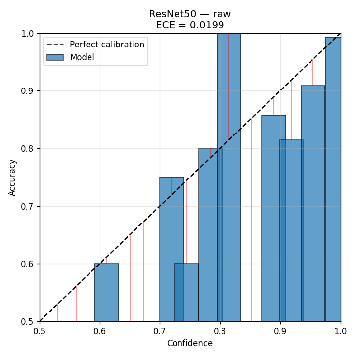{width=49%} 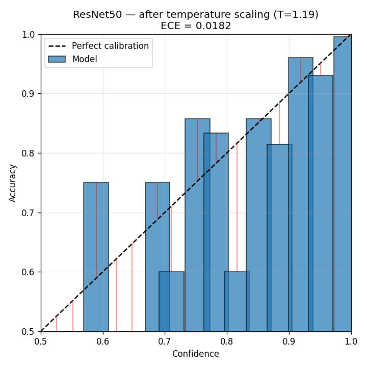{width=49%}

::: {custom-style="Image Caption"}
**Figura A.1.** ResNet50 reliability diagrams — raw (left) and temperature-scaled (right).
:::

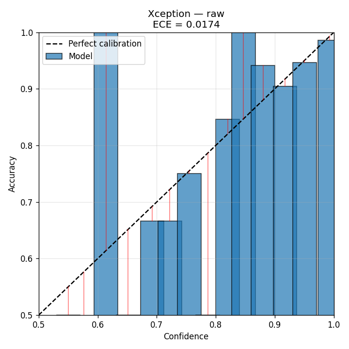{width=49%} 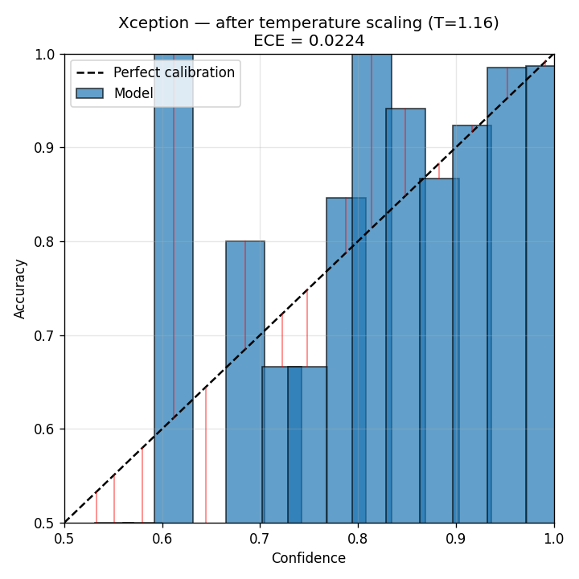{width=49%}

::: {custom-style="Image Caption"}
**Figura A.2.** Xception reliability diagrams — raw (left) and temperature-scaled (right).
:::

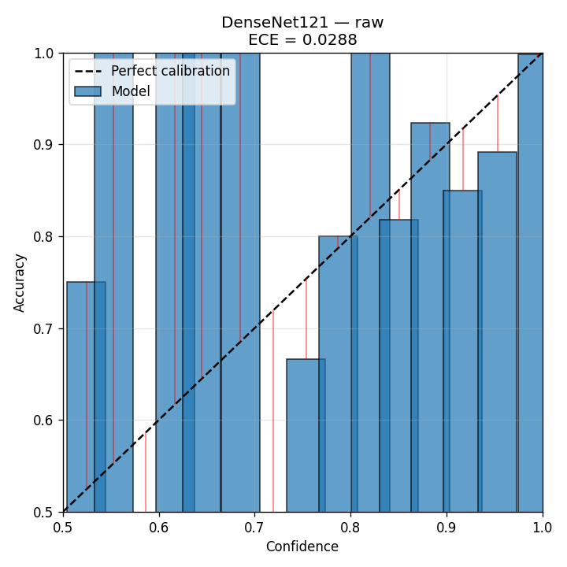{width=49%} 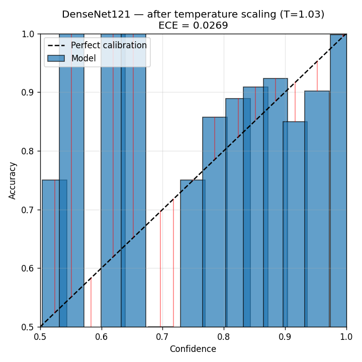{width=49%}

::: {custom-style="Image Caption"}
**Figura A.3.** DenseNet121 reliability diagrams — raw (left) and temperature-scaled (right).
:::

{width=49%} 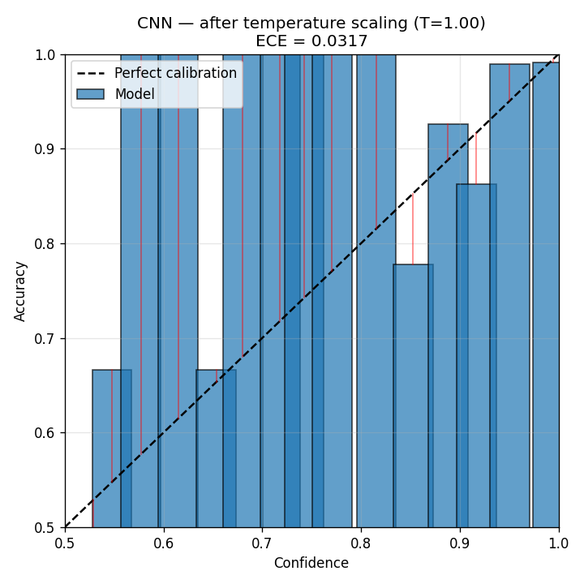{width=49%}

::: {custom-style="Image Caption"}
**Figura A.4.** From-scratch CNN reliability diagrams — raw (left) and temperature-scaled (right). The model is already well-calibrated (T ≈ 1.0).
:::

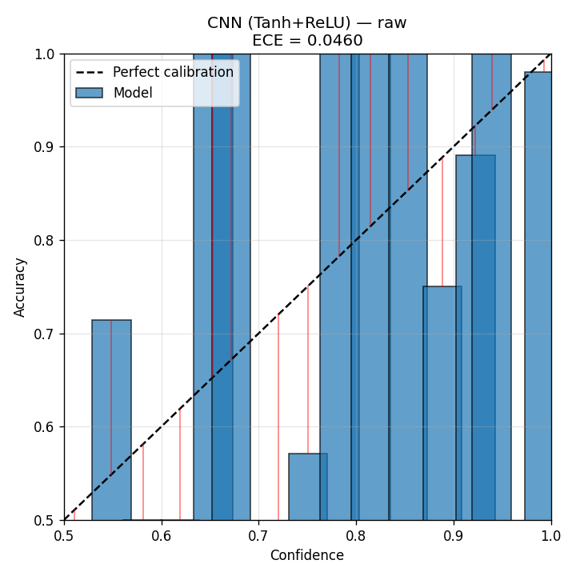{width=49%} 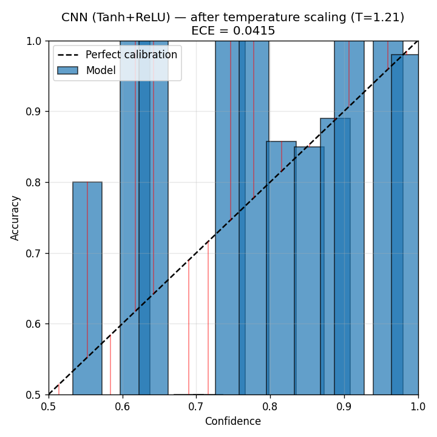{width=49%}

::: {custom-style="Image Caption"}
**Figura A.5.** CNN(Tanh+ReLU) reliability diagrams — raw (left) and temperature-scaled (right).
:::

## Shtojca D — Classical Classifier ROC Curves

The confusion matrices of the three classical classifiers appear in Figure 4.13 of the main text. Their ROC curves are reproduced here.

{width=49%} {width=49%}

::: {custom-style="Image Caption"}
**Figura A.6.** ROC curves for the Random Forest (left) and SVM (right) classifiers trained on DenseNet121 features.
:::

{width=49%}

::: {custom-style="Image Caption"}
**Figura A.7.** ROC curve for the Decision Tree classifier trained on DenseNet121 features.
:::

## Shtojca E — Multi-Class Reliability Diagrams

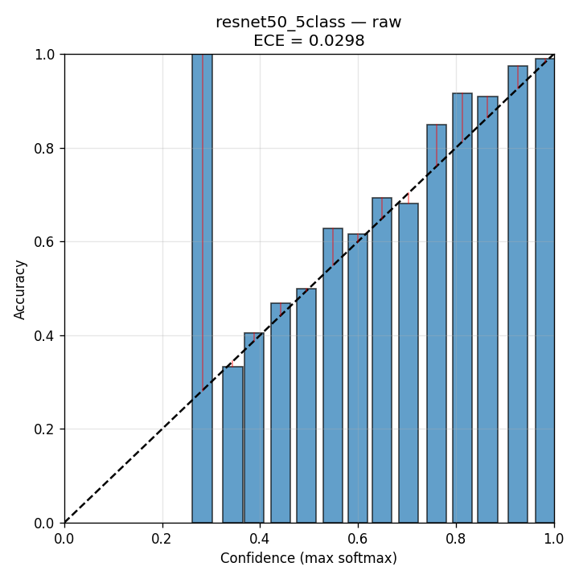{width=49%} 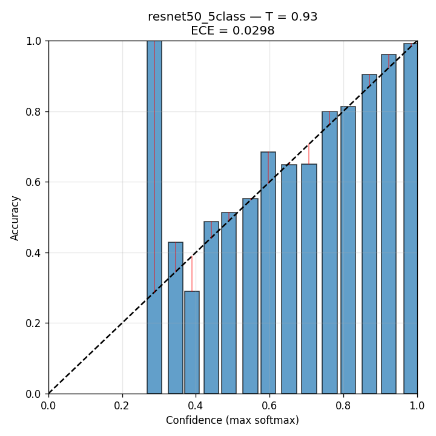{width=49%}

::: {custom-style="Image Caption"}
**Figura A.8.** resnet50_5class multi-class reliability diagrams — raw (left) and temperature-scaled (right).
:::

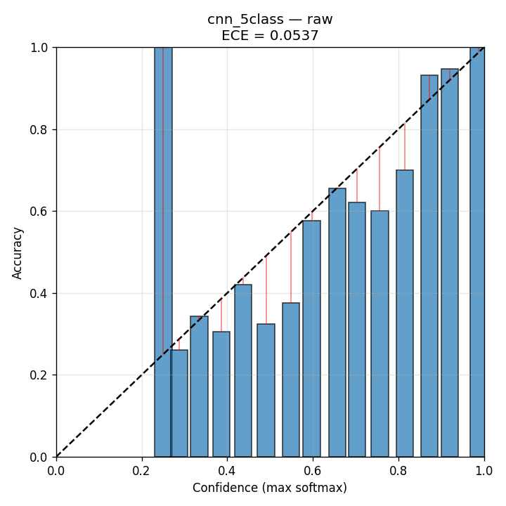{width=49%} 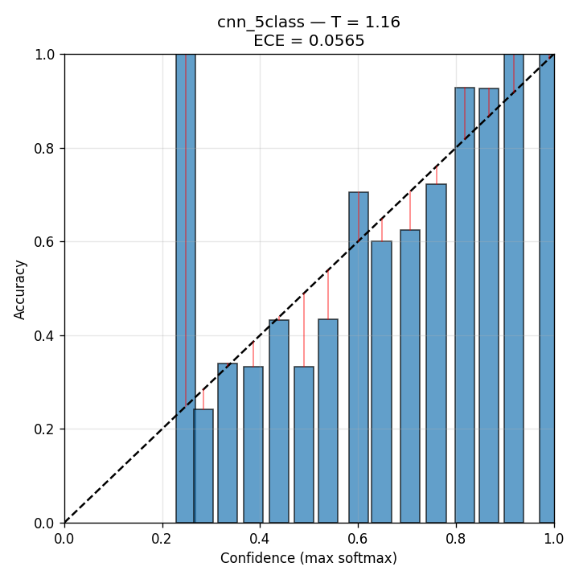{width=49%}

::: {custom-style="Image Caption"}
**Figura A.9.** cnn_5class multi-class reliability diagrams — raw (left) and temperature-scaled (right).
:::

## Shtojca F — Code Organisation

The complete codebase is open-source and organised into the following top-level packages:

| Path | Contents |
|------|----------|
| `app.py` | Streamlit decision-support application |
| `lib/inference.py` | Binary inference module |
| `lib/multiclass_inference.py` | 5-class inference module |
| `lib/uncertainty_inference.py` | Conformal + uncertainty quantification at inference time |
| `lib/quality.py` | Image-quality heuristics |
| `lib/report.py` | PDF report generation |
| `lib/i18n.py` | Multilingual (English / Albanian) interface |
| `scripts/train.py` | Unified training driver (`train.py --arch <name>`) |
| `scripts/helpers.py` | Splits, preprocessing, class weights |
| `scripts/ML.py` | Classical classifiers (DT, RF, SVM) on DenseNet features |
| `master/uncertainty/calibration.py` | ECE, MCE, temperature scaling (binary) |
| `master/uncertainty/calibration_mc.py` | QWK, ordinal distance, multi-class calibration |
| `master/uncertainty/conformal.py` | LAC, APS, conformal set construction |
| `master/uncertainty/mc_dropout.py` | Monte Carlo Dropout (T = 30 passes) |
| `master/uncertainty/ood.py` | MSP, Energy, Mahalanobis, cosine OOD scores |
| `master/uncertainty/ensemble.py` | Heterogeneous ensemble + selective accuracy |
| `master/uncertainty/stats_tests.py` | Bootstrap CI, McNemar, Cohen's kappa |
| `master/run_*.py` | Analysis drivers that produced every CSV, JSON and figure |
| `master/results/` | All experimental outputs, organised by phase |

The unified training driver supports the following architecture flags: `resnet50`, `xception`, `densenet121`, `vgg16`, `cnn`, `cnn_tanh`, `cnn_mcd`, `resnet50_mcd`, `cnn_5class`, and `resnet50_5class`.

## Shtojca G — Streamlit Application Screenshots

This appendix documents the deployed Streamlit decision-support application described in Section 3.11.5. The screenshots below were captured from a live session running on a consumer laptop, demonstrating that the full uncertainty-aware pipeline operates in real time and is usable by a non-technical clinician.

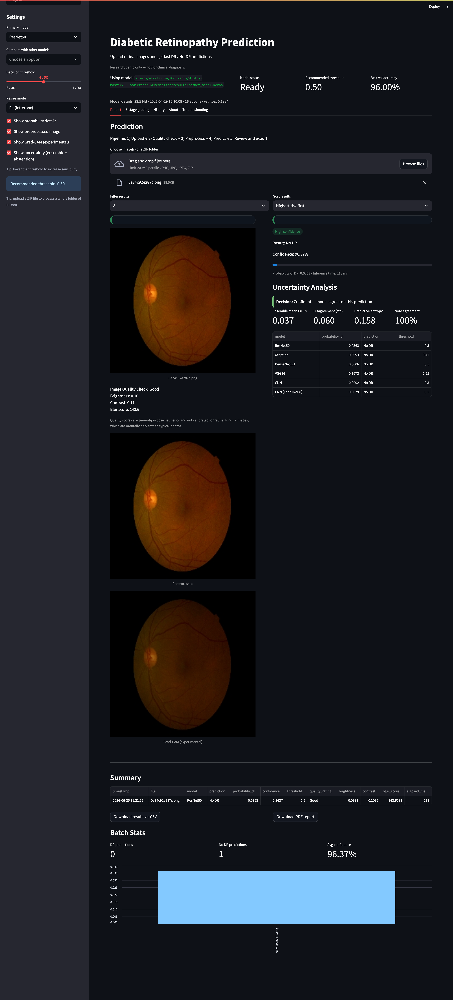{width=92%}

::: {custom-style="Image Caption"}
**Figura A.10.** Binary prediction view. A fundus image is uploaded and graded as "No DR" with 96.37% calibrated confidence and an inference time of ~150 ms. The sidebar exposes the primary-model selector, the decision threshold, the language switch (English / Albanian), and the optional uncertainty panels. The image-quality check (brightness, contrast, blur) and a per-batch summary table with CSV / PDF export are shown below the result.
:::

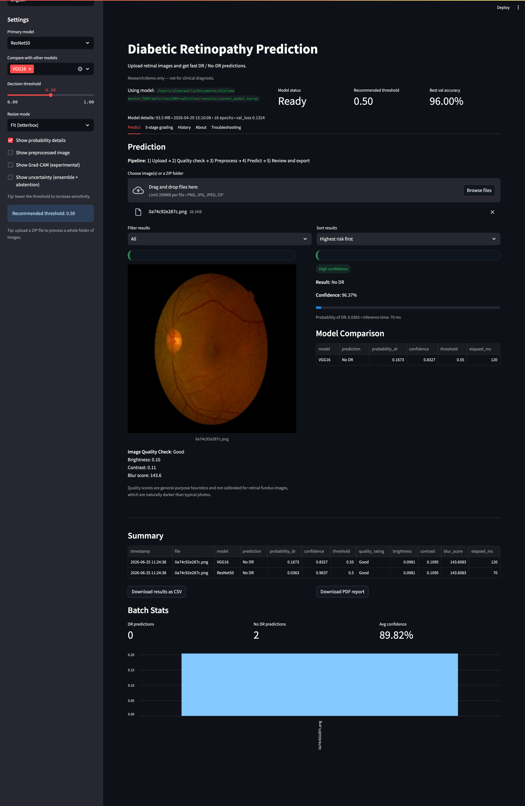{width=92%}

::: {custom-style="Image Caption"}
**Figura A.11.** Multi-model comparison view. The same image is graded simultaneously by ResNet50 (primary) and VGG16 (comparison). The "Model Comparison" table reports each model's prediction, probability of DR, calibrated confidence, decision threshold, and inference time, operationalising the ensemble-disagreement signal of Section 4.1.4 directly in the user interface.
:::

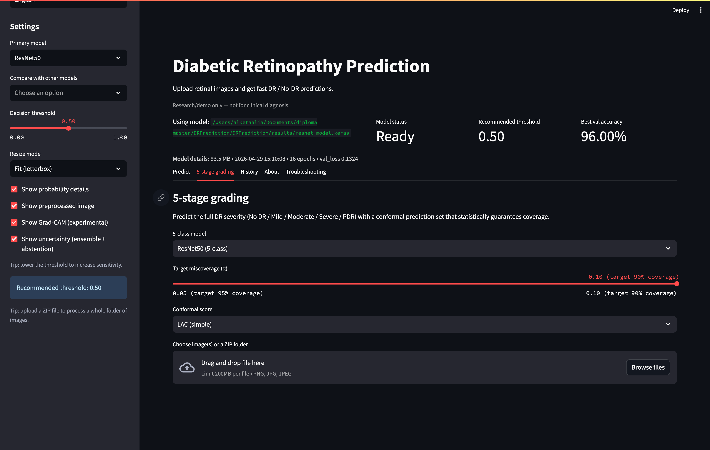{width=92%}

::: {custom-style="Image Caption"}
**Figura A.12.** 5-stage grading view. The user selects the 5-class model, the target miscoverage α (here 0.10, i.e. 90% target coverage), and the conformal score (LAC). The application returns the full No DR / Mild / Moderate / Severe / PDR prediction together with a conformal prediction set that statistically guarantees coverage, realising the triage policy of Section 4.3.4.
:::

\pagebreak
