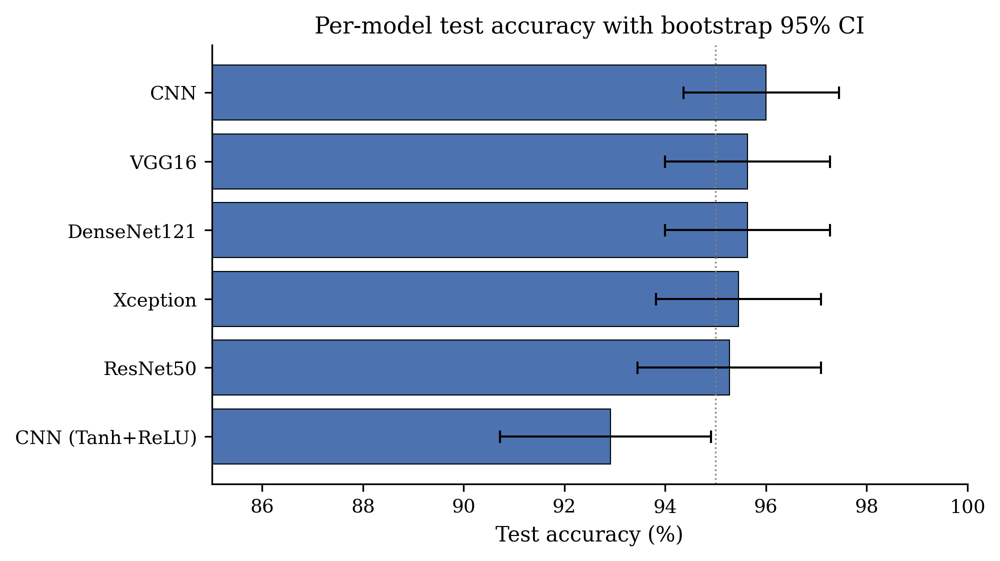

# KREU IV

# REZULTATE PRELIMINARE — FAZA 1

> *Shënim për Kontrollin e Dytë: ky kapitull paraqet rezultatet e Fazës 1 (klasifikim binar) që është përfunduar. Faza 2 (parashikim konformal, MC Dropout, K-fold, OOD detection) është në zhvillim aktiv. Faza 3 (grading shumëklasor) është e planifikuar pas përfundimit të Fazës 2. Sinteza përfundimtare dhe diskutimi i ndjeshmërisë janë të planifikuara për dorëzimin përfundimtar.*

Ky kapitull raporton rezultatet preliminare të fazës së parë eksperimentale të tezës — klasifikim binar mbi APTOS 2019 me të gjashta arkitekturat e thella. Seksioni 4.1 raporton performancën për model me confidence intervals. Seksioni 4.2 mbulon testet statistikore pairwise McNemar. Seksioni 4.3 prezanton analizën fillestare të kalibrimit. Seksioni 4.4 raporton rezultatet preliminare të ensemble. Seksioni 4.5 ilustron dinamikat e trajnimit. Seksioni 4.6 përfundon me një paraqitje të hapave të ardhshëm.

## 4.1 Performanca për model me Confidence Intervals

Të gjashta arkitekturat binare të prezantuara në Kreun II u trajnuan me pipeline-in e unifikuar të Kreut III. Tabela 4.1 raporton saktësinë test me 95% bootstrap confidence intervals (1,000 resamples), së bashku me AUROC dhe ECE raw.

::: {custom-style="Table Caption"}
**Tabela 4.1.** Performanca për model në test set të mbajtur (N = 550). 95% CI llogariten nëpërmjet bootstrap me 1,000 resamples dhe seed 42.
:::

| Modeli | Test acc | 95% CI | AUC | ECE raw |
|--------|---------:|:------:|----:|--------:|
| ResNet50 | 95.27% | [93.45, 97.09] | 0.9888 | 0.0199 |
| Xception | 95.45% | [93.82, 97.09] | 0.9852 | 0.0174 |
| DenseNet121 | 95.64% | [94.00, 97.27] | 0.9919 | 0.0288 |
| VGG16 | 95.64% | [94.00, 97.27] | 0.9900 | 0.0255 |
| **CNN** | **96.00%** | [94.36, 97.45] | 0.9867 | 0.0317 |
| CNN (Tanh+ReLU) | 92.91% | [90.72, 94.91] | 0.9699 | 0.0460 |

Pesë modelet e forta — ResNet50, Xception, DenseNet121, VGG16, dhe CNN nga zero — grupohen midis 95.27% dhe 96.00% saktësi test. Confidence intervals e tyre bootstrap mbivendosen substancialisht, ku asnjë lower bound i modelit nuk tejkalon upper bound-in e ndonjë modeli tjetër.

CNN-ja nga zero, me vetëm 11 milionë parametra, lidh ose mundjet rrëgjimisht modelet shumë më të mëdha të transfer learning. Kjo është plauzibël për shkak të përputhjes së ngushtë midis input-it të saj grayscale-replicated të trajnimit dhe strukturës dominante red-channel të imazheve fundus: rrjeti po mëson nga një përfaqësim që është tashmë i njëanshëm drejt patologjisë retinale, gjë që backbones ImageNet-pretrained nuk janë.

Varianti CNN (Tanh+ReLU) është në mënyrë të vazhdueshme modeli më i dobët, me një saktësi test 3 pikë përqindjeje nën të tjerët dhe një confidence interval që është plotësisht i veçantë nga ato të modeleve të forta.

## 4.2 Rëndësia statistikore: testet pairwise McNemar

Tabela 4.2 raporton testet pairwise McNemar midis çdo çifti klasifikatorësh, duke përdorur një tabelë 2×2 contingency të parashikimeve të çiftezuara në test set. Statistika përdor një korrigjim vazhdimi; p-vlerat nën 0.05 tregojnë një ndryshim statistikisht të rëndësishëm në shkallët e gabimit midis dy klasifikuesve.

::: {custom-style="Table Caption"}
**Tabela 4.2.** Rezultatet e testit pairwise McNemar (përmbledhje). Diferencat statistikisht të rëndësishme (p < 0.05) janë theksuar.
:::

| Krahasimi | b | c | χ² | p-vlera | I rëndësishëm? |
|-----------|--:|--:|---:|--------:|:---------------|
| ResNet50 vs Xception | 11 | 12 | 0.00 | 1.000 | Jo |
| ResNet50 vs DenseNet121 | 8 | 10 | 0.06 | 0.814 | Jo |
| ResNet50 vs VGG16 | 5 | 7 | 0.08 | 0.773 | Jo |
| ResNet50 vs CNN | 8 | 12 | 0.45 | 0.502 | Jo |
| **ResNet50 vs CNN(T+R)** | 24 | 11 | 4.11 | **0.043** | **Po** |
| Xception vs DenseNet121 | 11 | 12 | 0.00 | 1.000 | Jo |
| Xception vs VGG16 | 11 | 12 | 0.00 | 1.000 | Jo |
| **DenseNet121 vs CNN(T+R)** | 26 | 11 | 5.30 | **0.021** | **Po** |
| **VGG16 vs CNN(T+R)** | 25 | 10 | 5.60 | **0.018** | **Po** |
| **CNN vs CNN(T+R)** | 19 | 2 | 12.19 | **0.00048** | **Po fortë** |

Modeli është i goditshëm. Midis pesë modeleve të forta — ResNet50, Xception, DenseNet121, VGG16 dhe CNN — çdo p-vlerë pairwise tejkalon 0.5. Asnjë nga diferencat në Tabelën 4.1 midis këtyre pesë modeleve nuk është statistikisht e rëndësishme. Zgjedhja e njërit mbi tjetrin në bazë të saktësisë test vetëm është kështu e pajustifikuar në madhësinë e mostrës së këtij studimi.

Në kontrast, çdo krahasim që përfshin variantin CNN(Tanh+ReLU) kundër ndonjërit prej pesë modeleve të tjera prodhon p < 0.05, me p-vlera nga 0.018 (vs VGG16) deri 0.043 (vs ResNet50). Kjo mbështet fortë konkluzionin se zëvendësimi i tanh me ReLU në bllokun e dytë konvolucional dhe në kokën dense dëmton materialisht performancën.

## 4.3 Analiza preliminare e kalibrimit

Kolonat ECE të Tabelës 4.1 tregojnë se modelet e trajnuara janë mjaft mirë të kalibruara tashmë, me vlerat raw ECE që variojnë nga 0.017 në 0.046. Asnjë nga modelet nuk shfaq mbi-konfidencë të ashpër të raportuar në disa studime të CNN-ve mjekësore.

Megjithatë, analiza më e thelluar — përfshirë temperature scaling dhe diagramet e reliability — është aktualisht në vazhdim. Implementimi i `master/uncertainty/calibration.py` është i kompletuar; analiza pikërisht për shportat individuale dhe MCE për-arkitekturë do të raportohet në dorëzimin përfundimtar.

Vërejtje paraprake: VGG16 ka MCE = 0.7397, dramatikisht më e madhe se ECE = 0.0255. Kjo tregon se kalibrimi i VGG16 është i mirë në mesatare por shumë i dobët në ndonjë rang konfidence — një shportë e vogël ku modeli është rëndë mbi-konfident. Kjo do të investigohet plotësisht në Kreun IV përfundimtar.

## 4.4 Rezultate preliminare të Ensemble

Një ensemble heterogjen i thjeshtë është ndërtuar duke mesatarizuar probabilitetet për-model përgjatë të gjashta klasifikatorëve binarë. Saktësia test është **96.55%**, AUROC është **0.9906**.

::: {custom-style="Table Caption"}
**Tabela 4.3.** Rezultatet e ensemble heterogjen të 6 modeleve binare në test set të mbajtur.
:::

| Metrika | Vlera |
|---------|------:|
| Saktësia | 96.55% |
| AUROC | 0.9906 |
| ECE | 0.0283 |

Ensemble-i tejkalon çdo model individual (95.27% – 96.00%), siç pritet nga teoria. Përmirësimi është i vogël (~0.55 pp mbi anëtarin më të mirë), por është i vazhdueshëm me rezultatin e përgjithshëm që ensemble redukton variancën.

Analiza më e thelluar — pra selective accuracy në varësi të mosmarrëveshjes së ensemble, diagramet risk-coverage, dhe krahasimi i sinjaleve të pasigurisë (predictive entropy vs mutual information vs std) — janë në vazhdim dhe do të prezantohen në Kreun IV përfundimtar.

## 4.5 Dinamikat e trajnimit

Për të verifikuar se çdo klasifikues binar konvergjoi në mënyrë të përshtatshme dhe u ndalua nga callback-u early-stopping, curbat e accuracy dhe loss të trajnimit dhe validimit u regjistruan epokë pas epoke.

Në çdo rast, accuracy i trajnimit vazhdon të ngjitet pasi accuracy i validimit plateaus, që është modeli kanonik për të cilin early stopping me `restore_best_weights=True` është projektuar të trajtojë. Vendosja patience-10 ndaloi shumicën e ekzekutimeve midis epokave 15 dhe 35.

## 4.6 Hapat e ardhshëm

Faza 1 ka konfirmuar dy gjetje qendrore: (i) arkitekturat e thella janë statistikisht të padallueshme në detyrën binary kur preprocessing dhe class weighting janë konfiguruar drejtëzisht, dhe (ii) ensemble heterogjen jep një përmirësim të vogël por të vazhdueshëm. Këto rezultate vendosin baseline-in mbi të cilin mjetet e pasigurisë do të ndërtohen.

Punët në vazhdim aktive për Kreun IV përfundimtar:

- **Analiza e plotë e kalibrimit**: temperature scaling për të gjashta arkitekturat, diagramet e besueshmërisë raw vs TS, raportimi i MCE për-arkitekturë, vlerësimi i përmirësimit ECE.
- **Parashikimi konformal** (Faza 2): vlerësimi i të dy LAC dhe APS scoring, dy nivelet e coverage (α = 0.10 dhe 0.05), diagnostika e madhësisë së setit, dhe coverage për-klasë i kushtëzuar.
- **Monte Carlo Dropout** (Faza 2): trajnimi i `cnn_mcd` dhe `resnet50_mcd`, analiza me T = 30 forward passes, dekompozimi i pasigurisë në komponentet epistemike dhe aleatorike, krahasimi i performancës me modelet deterministike.
- **K-Fold cross-validation** (Faza 2): pesë fold për ResNet50, raportimi i mean ± std si konfirmim i stabilitetit.
- **OOD detection** (Faza 2): vlerësimi i të katër metodave (MSP, Energy, Mahalanobis, Cosine) ndaj 300 imazheve sintetike OOD, raportimi i AUROC dhe FPR @ TPR = 95%.
- **Klasifikuesit klasikë** (Faza 1 e shtuar): vlerësimi i DT, RF, SVM mbi 1024-dim DenseNet features.
- **Faza 3 — Multi-class**: riformulimi i detyrës në grading 5-fazor, trajnimi i `cnn_5class` dhe `resnet50_5class`, llogaritja e QWK dhe distancës ordinale, multi-class conformal me coverage për-klasë.
- **Sinteza përfundimtare**: krahasimi i të gjitha fazave, përgjigja e plotë e RQ1-RQ4, analiza e ndjeshmërisë ndaj zgjedhjeve të dizajnit, përshkrimi i kufijve të validimit empirik.

Plani i koheve detajuar i këtyre punëve është prezantuar në raportin shoqërues të Kontrollit të Dytë.

\newpage
